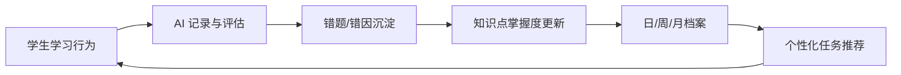

# 产品蓝图

## 一句话定位

君航 AI 助教是一个以学生成长档案为核心的课后辅导系统，帮助学生练习、答疑、改错，帮助老师和家长看见真实学习过程。

## 用户

- 学生：完成任务、提问、听写背书、练题、查看错题。
- 家长：查看日常表现、阶段报告、学习建议。
- 老师：创建任务、生成材料、批改作业、查看学生画像。
- 管理员：维护班级、教材、模型、权限和服务接入。

## 第一阶段闭环

## 小程序模块

- 今日学习：任务、提醒、最近错题、学习入口。
- 背书听写：课文录入、听写生成、背诵识别、错漏分析。
- AI 答疑：按年级解释，支持继续追问、举例和再练一道。
- 英语词汇：意思、词性、搭配、例句、易错点、造句批改。
- 作业试卷：按年级、学科、知识点、难度生成并批改。
- 错题本：自动归类、错因分析、同类题重练。
- 学生档案：基本信息、日/周/月/期中/期末报告。
- 家长端：可读报告、进步提醒、待关注问题。
- 老师端：班级、学生、任务、素材、报告和批改管理。

## 独立 Web 端模块

- Web 模拟端：先验证小程序页面、交互、数据闭环。
- 管理后台：老师使用，管理学生、任务、教材、批改和报告。
- AI 教学实验室：PPT、3D 场景、虚拟人物、投影课堂。

