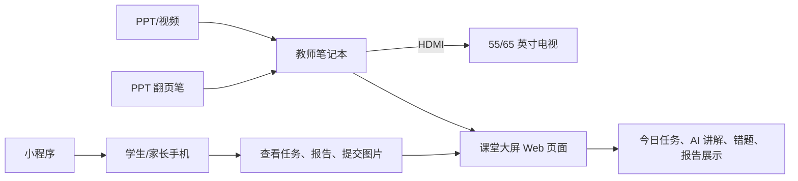

# 暑期 AI 加强班启动方案

## 1. 阶段定位

暑假阶段不做小饭桌托管，不主打看护，不以低价抢学生。

本阶段定位为：

> 君航 AI 暑期加强班：用小班实操、AI 诊断、错题追踪和学习报告，让家长看见孩子的真实进步过程。

暑假核心目标不是一次性招很多人，而是先做出一批可展示、可复盘、可转介绍的样板学生，为开学后的 AI 学习管理班积累口碑。

## 2. 暑期目标

### 招生规模

- 年级：新四年级、新五年级、新六年级。
- 当前学生：三年级升四年级、四年级升五年级、五年级升六年级。
- 每个年级：4 人。
- 总人数：12 人。
- 班型：每个年级一个小班，或按水平临时合并做专项课。

### 经营目标

- 跑通学生入班诊断、AI 辅助教学、错题沉淀、家长反馈、屏幕展示、小程序使用的完整闭环。
- 沉淀 12 份学生成长档案。
- 形成至少 6 个可对外展示的真实进步案例。
- 暑假结束前完成开学 AI 学习管理班的首批转化。

### 品牌目标

让新舟镇家长形成一个简单认知：

> 君航不是普通托管，也不是传统补课班，而是能记录、分析、反馈孩子学习过程的 AI 学习辅导班。

## 3. 产品结构

### 主推产品：暑期 AI 加强班

面向暑假后进入新四、新五、新六的学生，围绕三件事：

- 巩固旧课：查漏补缺，解决上学期遗留问题。
- 预习新课：提前接触下学期重点内容。
- 建立方法：训练错题整理、表达思路、独立订正、每日复盘。

### 后续产品：开学 AI 学习管理班

暑假结束后转入月费制，主打：

- 每日学习任务。
- 作业问题记录。
- AI 答疑与错题讲解。
- 周报告/月报告。
- 阶段性薄弱点专项练习。

## 4. 第一批学生筛选标准

第一批学生不是随便招满，而是要选适合做样板的孩子。

### 优先选择

- 家长愿意沟通，能配合查看报告和反馈。
- 孩子愿意表达，不一定成绩好，但愿意改。
- 基础中等或中等偏弱，短期内容易看到变化。
- 作业习惯、错题订正、计算/阅读/词汇等问题比较明确。
- 能保证暑假出勤，不频繁请假。

### 暂缓选择

- 家长只想免费体验，不愿沟通。
- 家长要求短期保证提分、保证名次。
- 孩子严重抗拒学习，且家长完全无法配合。
- 行为习惯严重影响小班秩序。
- 暑假无法保证稳定到课。

### 建议筛选方式

报名后先做三步：

1. 家长沟通 10 分钟：了解孩子年级、学校、成绩区间、主要问题、暑假时间。
2. 学生小测 30 分钟：语文/数学/英语各取少量代表题，不做大规模考试。
3. 学习习惯观察 10 分钟：看孩子读题、表达、订正、是否愿意追问。

最终不是选成绩最好的，而是选最适合跑通案例的。

## 5. 五天免费体验班

### 体验班定位

体验班不叫免费补课，建议叫：

> 5 天 AI 学习诊断体验营

对外表达：

> 免费体验 5 天，但需提前报名筛选。每个年级仅开放 4 个体验席位，通过体验后可优先进入暑期 AI 加强班。

### 每日安排

#### Day 1：入班诊断与学习档案建立

- 学生完成年级诊断题。
- 记录做题速度、审题问题、错题类型。
- 建立学生基础档案。
- 家长端输出简短诊断结论。

当天展示重点：

- 不是分数高低，而是孩子哪里不会、为什么错。

#### Day 2：旧课漏洞修复

- 从 Day 1 错题中选 2-3 个关键知识点讲解。
- AI 生成同类题，学生当场练习。
- 记录是否能从“听懂”变成“做对”。

当天展示重点：

- 错题不是讲完就算，要能重练和归因。

#### Day 3：新课预习体验

- 选下学期一个容易建立信心的知识点。
- 用“老师讲解 + AI 举例 + 学生复述”的方式完成。
- 生成 3-5 道分层练习。

当天展示重点：

- 新课不是提前灌内容，而是提前建立理解入口。

#### Day 4：AI 答疑与表达训练

- 学生提出一个自己不懂的问题。
- AI 给出年级化解释。
- 学生用自己的话复述。
- 老师判断是否真正理解，并补充纠偏。

当天展示重点：

- AI 不是替代老师，而是让孩子敢问、能追问、讲得明白。

#### Day 5：体验总结与家长反馈

- 完成一套小型复测。
- 对比 Day 1 的错误类型。
- 输出《5 天 AI 学习诊断报告》。
- 和家长沟通是否适合进入暑期加强班。

当天展示重点：

- 家长看到孩子的具体问题、变化和后续计划。

## 6. 暑期正式班建议

### 课时结构

建议周期：4-6 周。

建议频率：

- 每周 4 次课。
- 每次 90-120 分钟。
- 每个年级固定时段。

单人运行时，不建议一天排太满。优先保证课堂质量、记录质量和家长反馈质量。

### 每周结构

#### 第 1 次：旧课查漏

- 针对上学期知识点做薄弱点训练。
- 重点记录错题和错因。

#### 第 2 次：新课预习

- 讲下学期核心知识点。
- 配套基础题和理解题。

#### 第 3 次：专项训练

- 数学计算/应用题。
- 语文阅读/表达。
- 英语词汇/句型/听写。

每周根据年级选择一个主专项，不要一次铺太多。

#### 第 4 次：复盘与小测

- 小测。
- 错题重练。
- 生成本周学习报告。
- 整理下周计划。

## 7. 小程序与屏幕展示方案

### 现场屏幕展示

机构现场建议连接大屏，展示教师端或展示页，但要注意隐私。

可以展示：

- 今日课程任务。
- 本班知识点进度。
- 匿名错题分布。
- AI 答疑示例。
- 本周共性问题。
- 学生个人报告样张。

不建议公开展示：

- 学生真实姓名。
- 家长电话。
- 单个学生具体分数排名。
- 明确暴露孩子短板的内容。

### 课堂使用方式

屏幕在课堂中承担三种角色：

- 任务板：今天学什么、练什么、完成到哪一步。
- 讲解板：展示 AI 解释、例题、同类题。
- 复盘板：展示本节课共性错因和下次任务。

### 家长参观展示

家长来咨询时，只展示样例数据或匿名数据。

推荐展示顺序：

1. 学生入班档案。
2. 今日任务。
3. AI 答疑记录。
4. 错题归因。
5. 周报告样张。

让家长看到完整闭环，而不是只看到一个聊天机器人。

## 8. 收费建议

### 五天体验班

建议免费，但必须筛选和预约。

对外说法：

> 本次体验班为暑期 AI 加强班内测名额，不是公开免费补课。每个年级仅 4 个席位，需要完成入班诊断后确认。

### 暑期 AI 加强班

建议采用整期收费或按阶段收费。

试运行价格可以设置为：

- 4 周班：1280-1680 元。
- 6 周班：1980-2680 元。

具体价格需要结合当地消费水平、课次、时长、场地成本和家长接受度调整。

建议首期使用“创始体验价”，但不要做低价促销：

> 首期为系统共创名额，费用低于正式价，但需要配合完成学习反馈和案例复盘。

### 开学 AI 学习管理班

建议月费制：

- AI 学习管理基础版：每日任务 + 错题记录 + 周反馈。
- AI 学习管理强化版：基础版 + 每周专项练习 + 阶段测评。
- AI 学习管理精品版：强化版 + 个性化学习计划 + 月度家长沟通。

不建议承诺保分、提分、排名变化。建议表达为：

> 帮助孩子建立学习过程记录、错题追踪和持续反馈机制。

## 9. 对外宣传文案

### 主标题

君航 AI 暑期加强班

### 副标题

新四、新五、新六限额小班，每个年级仅 4 人。

### 核心卖点

- AI 诊断学习问题。
- 老师把关讲解过程。
- 错题归因持续追踪。
- 每周生成学习反馈。
- 暑假巩固旧课，预习新课。

### 朋友圈文案

君航 AI 暑期加强班开始招募第一批体验学生。

本期只招新四、新五、新六学生，每个年级 4 人。我们不做普通托管，而是通过 AI 学习诊断、错题追踪、老师讲解和每周反馈，帮助孩子在暑假看清问题、补上漏洞、提前进入新学期状态。

前 5 天为 AI 学习诊断体验营，免费参加，但需要提前筛选。体验结束后，每个孩子会获得一份学习诊断报告，家长可以清楚看到孩子的问题、变化和后续建议。

适合：作业拖拉、错题反复、基础不稳、家长想了解孩子真实学习状态的新四、新五、新六学生。

### 家长沟通话术

我们这个暑假不是做小饭桌，也不是简单补课。我们想先帮孩子建立一个学习档案，看清楚孩子到底是知识点不会、审题问题、计算问题，还是学习习惯问题。

前 5 天体验不收费，但我们会筛选，因为每个年级只收 4 个孩子。体验结束后会给您一份诊断反馈，如果孩子适合继续，我们再进入暑期 AI 加强班；如果不适合，我们也会如实告诉您孩子目前更需要什么。

我们不会承诺几天提高多少分，但会让您看到孩子每天学了什么、错在哪里、有没有改、下一步该怎么练。

## 10. 5 天体验班产出物

每个学生必须产出：

- 入班诊断记录。
- 至少 5 道关键错题。
- 2-3 个主要错因。
- 一次 AI 答疑记录。
- 一次旧课重练记录。
- 一次新课预习记录。
- 一份《5 天 AI 学习诊断报告》。

每个年级必须产出：

- 共性薄弱点清单。
- 本年级暑期加强班教学计划。
- 1 份匿名展示案例。

## 11. 运营时间表

### 5 月 25 日-5 月 31 日

- 确定暑期班名称、宣传文案、报名表。
- 完成体验班诊断题模板。
- 准备家长沟通话术。
- 准备屏幕展示页面或样例数据。

### 6 月 1 日-6 月 15 日

- 开始朋友圈、熟人介绍、线下家长沟通。
- 收集意向学生信息。
- 做第一轮家长沟通和学生筛选。

### 6 月 16 日-6 月 25 日

- 确认 12 名体验学生。
- 完成分班和时间安排。
- 为每个学生建立基础档案。
- 准备 4/5/6 年级体验班题目。

### 6 月下旬或暑假开始第一周

- 开展 5 天 AI 学习诊断体验营。
- 每天记录学习过程。
- 第 5 天集中输出诊断报告并沟通转化。

### 7 月-8 月

- 正式开展暑期 AI 加强班。
- 每周输出学习反馈。
- 每两周沉淀一次展示案例。
- 暑假末进行成果总结和开学班续费转化。

### 8 月下旬

- 发布暑期成果案例。
- 开放开学 AI 学习管理班名额。
- 优先转化暑期学生，再开放新生体验名额。

## 12. 单人执行注意事项

你目前一个人执行，最重要的是控制复杂度。

### 必须做

- 每节课记录关键错题。
- 每周给家长反馈。
- 每个孩子有档案。
- 每个年级有教学计划。
- 每次展示使用匿名或样例数据。

### 暂时不做

- 不做全天托管。
- 不做大量年级混班。
- 不做复杂积分排行。
- 不做过度承诺。
- 不做家长群高频刷屏。

### 每天固定流程

1. 课前 10 分钟：打开今日任务和学生档案。
2. 课堂 60-80 分钟：讲解、练习、AI 答疑、错题记录。
3. 课后 15 分钟：整理错题和当天反馈。
4. 晚上 10 分钟：给需要重点沟通的家长发简短反馈。

## 13. 合规边界

宣传时建议避免：

- 保证提分。
- 保证名次。
- 夸大 AI 效果。
- 暗示替代学校教学。
- 长周期、大额预收费。

推荐表达：

- 学习诊断。
- 错题追踪。
- 过程反馈。
- 习惯培养。
- 巩固旧课。
- 预习新课。
- 老师把关，AI 辅助。

## 14. 当前最小行动清单

- 确定暑期班最终名称。
- 确定 4/5/6 年级体验时间。
- 制作报名登记表。
- 准备三套年级诊断题。
- 准备《5 天 AI 学习诊断报告》模板。
- 准备匿名屏幕展示样例。
- 从熟人家长中邀约第一批 12 个候选学生。

## 15. 报名筛选表

### 学生信息

- 学生姓名：
- 当前年级：
- 就读学校：
- 教材版本：
- 家长姓名：
- 联系电话：
- 暑假可到课时间：

### 学习情况

- 上学期语文大概情况：
- 上学期数学大概情况：
- 上学期英语大概情况：
- 孩子最明显的问题：
- 作业是否拖拉：
- 是否愿意主动提问：
- 错题是否会订正：
- 家长最希望暑假解决的问题：

### 筛选判断

- 是否适合 5 天体验：
- 适合年级班：
- 重点观察方向：
- 是否建议进入暑期加强班：
- 备注：

## 16. 体验班诊断题生成规则

体验班题目不要追求难，而要追求“看得出问题”。

### 新四年级

数学：

- 计算基础。
- 应用题读题。
- 图形或单位换算。
- 上学期核心概念。
- 下学期预习引入题。

语文：

- 字词基础。
- 句子修改。
- 简短阅读理解。
- 概括表达。
- 片段表达。

英语：

- 重点词汇认读。
- 基础句型。
- 单词拼写。
- 选择题。
- 简短翻译或造句。

### 新五年级

数学：

- 分数/小数计算。
- 应用题数量关系。
- 几何或图形面积。
- 计算过程规范。
- 新课预习引入题。

语文：

- 词语理解。
- 阅读信息提取。
- 人物/事件概括。
- 病句或句式转换。
- 小片段表达。

英语：

- 词汇词性。
- 时态或基本句型。
- 阅读判断。
- 造句。
- 听写或拼写。

### 新六年级

数学：

- 分数、百分数或比的基础。
- 应用题建模。
- 几何综合。
- 计算准确率。
- 小升初衔接题。

语文：

- 阅读理解。
- 文章主旨。
- 句段作用。
- 表达观点。
- 作文素材片段。

英语：

- 词汇和短语。
- 时态综合。
- 阅读理解。
- 句型转换。
- 口头表达或造句。

### 每套诊断题建议

- 总时长：30-40 分钟。
- 数学：6-8 题。
- 语文：1 篇短阅读 + 3-5 个基础题。
- 英语：8-12 个小题。
- 难度比例：基础 60%，中等 30%，拔高 10%。

生成题目时需要保留答案和错因观察点，方便后续写报告。

## 17. 5 天学习诊断报告模板

# 学生 5 天 AI 学习诊断报告

学生：

年级：

体验时间：

## 一、整体观察

孩子在 5 天体验中的整体状态：

## 二、主要优势

- 优势 1：
- 优势 2：
- 优势 3：

## 三、主要问题

- 问题 1：
- 问题 2：
- 问题 3：

## 四、错题与错因

| 学科 | 代表错题 | 错因 | 后续建议 |
| --- | --- | --- | --- |
| 数学 |  |  |  |
| 语文 |  |  |  |
| 英语 |  |  |  |

## 五、5 天变化

- 第 1 天表现：
- 第 3 天变化：
- 第 5 天表现：

## 六、是否建议进入暑期 AI 加强班

建议结果：

原因：

## 七、后续学习建议

- 建议 1：
- 建议 2：
- 建议 3：

## 18. 家长邀约话术

### 熟人邀约

我们暑假准备做一个新四、新五、新六的 AI 学习诊断体验营，每个年级只收 4 个孩子。这个不是小饭桌，也不是普通补课，主要是用 5 天时间看看孩子学习上到底卡在哪里：是知识点没掌握、审题问题、计算问题，还是学习习惯问题。

体验结束后会给你一份孩子的学习诊断反馈。因为人数很少，所以会先筛选适合的孩子。如果你觉得孩子暑假需要查漏补缺、提前进入新学期状态，可以先带孩子过来做个简单测评。

### 咨询家长回复

我们这期是暑期 AI 加强班的内测体验，每个年级只有 4 个名额。前 5 天免费，主要做学习诊断和适配观察。体验不是单纯听课，而是会记录孩子的错题、听课状态、表达能力和订正情况。体验结束后，如果孩子适合，我们再建议进入正式暑期班；如果不适合，我们也会如实反馈。

### 价格咨询回复

前 5 天诊断体验不收费，但需要提前报名筛选。正式暑期 AI 加强班会根据课次和周期收费，首期是系统共创价，会低于后续正式价格。我们不靠低价吸引学生，重点是小班、反馈和学习档案。

## 19. 开学转化设计

暑期班最后一周，不要直接硬推续费，而是做一次“暑期成长复盘”。

### 复盘内容

- 暑假最明显的 3 个变化。
- 还没有解决的 2 个问题。
- 开学后最容易掉队的 1 个风险点。
- 建议进入的 AI 学习管理班类型。

### 转化话术

暑假这段时间，我们已经比较清楚孩子的学习特点了。开学后最关键的不是再讲多少新内容，而是每天作业和错题不能断档。如果开学后继续做 AI 学习管理，我们会把孩子的每日作业问题、错题和周反馈接着记录下去，这样家长能持续看到学习状态，不会又回到以前“只知道写没写完，不知道到底会不会”的情况。

## 20. 小程序第一版配合暑期班的优先级

暑期阶段，小程序不需要一次做完所有功能，优先服务招生展示和课堂交付。

### 第一优先级

- 学生档案。
- 今日任务。
- 错题记录。
- AI 答疑记录。
- 周报告/5 天报告。

### 第二优先级

- 练习生成。
- 作答图片提交。
- 老师批改录入。
- 家长查看报告。

### 暑期展示页建议

单独做一个“课堂大屏模式”，只展示匿名数据：

- 今日课程目标。
- 本节知识点。
- 本班共性错题。
- AI 讲解示例。
- 本周学习进度。

这会比单纯展示小程序首页更有冲击力。

## 21. 大屏硬件与连接方案

### 推荐方案

第一阶段推荐：

> 55/65 英寸电视 + 笔记本 + HDMI 连接 + PPT 翻页笔 + 课堂大屏 Web 页面。

不建议第一阶段直接购买昂贵的交互智能平板，也不需要追求 75 英寸以上。你目前是单人授课，小程序和 Web 还在持续开发中，最重要的是稳定展示、便于讲解、成本可控。

### 尺寸选择

#### 首选：65 英寸

- 适合 8-12 人小班。
- 能清楚展示 Web 课堂大屏、PPT、题目和视频。
- 预算通常可以控制在 2000 元左右或略高。
- 比 55 英寸更有课堂展示感，家长参观时效果更好。

#### 备选：55 英寸

- 适合 4-8 人小班或教室纵深较短的空间。
- 成本更低，安装更轻便。
- 如果后排距离超过 3 米，展示题目时会偏小。

#### 暂不推荐：75 英寸以上

- 超出当前预算和阶段需要。
- 安装、移动、售后成本更高。
- 等后期学生规模扩大、课堂展示成为稳定卖点后再升级。

### 分辨率建议

预算虽然控制在 2000 元左右，但仍建议优先买 4K 电视，不必刻意找 2K 屏。

原因：

- Web 端文字、表格、错题和报告在 4K 下更清楚。
- 65 英寸电视市场主流已经是 4K，选择更多。
- PPT、视频、浏览器页面都能兼容。
- 课堂使用不需要高刷新率，普通 60Hz 足够。

### 预算档位

#### 实用档

- 55 英寸 4K 电视。
- 现有 Windows 笔记本。
- HDMI 线。
- PPT 翻页笔。

适合先启动暑期班，成本最低。

#### 推荐档

- 65 英寸 4K 电视。
- 现有 Windows 笔记本。
- HDMI 线。
- PPT 翻页笔。
- 移动支架或壁挂架。
- 小音箱。

适合长期放在机构里，开机即可进入课堂大屏。

#### 升级档

- 75/86 英寸电视或交互智能平板。
- 内置白板、批注、投屏、摄像头或会议功能。

适合后期学生规模扩大、老师增加、需要大量板书批注时再考虑。

### 设备清单

第一阶段建议采购：

- 55/65 英寸 4K 电视 1 台，优先 65 英寸。
- Windows 笔记本 1 台，优先使用现有设备。
- HDMI 2.0 线 1 根，长度按教室布置选择。
- PPT 翻页笔 1 个。
- 无线鼠标 1 个。
- 移动电视支架或墙面壁挂架 1 套。
- 插线板和理线槽。
- 可选：USB 实物展台或高清摄像头，用于展示学生作业、讲义、手写过程。
- 可选：小音箱，用于播放英语听力、视频和 AI 语音。

### 连接结构

### 与小程序的关系

不要让电视直接跑小程序。更稳定的方式是：

- 小程序负责学生和家长使用。
- Web 教师端负责课堂控制和大屏展示。
- 大屏显示 Web 的“课堂大屏模式”。
- 小程序里的数据同步到 Web 后，再由大屏展示匿名汇总或单个学生授权内容。

这样后续迁移也更清晰：

- 学生手机：提交、查看、练习。
- 家长手机：看报告、看反馈。
- 教师电脑：管理、批改、生成任务。
- 大屏电视：讲解、展示、复盘。

### 课堂大屏模式功能

第一版建议只做 5 个区块：

1. 今日目标：本节课学什么。
2. 课堂任务：诊断、讲解、练习、订正、复盘。
3. AI 讲解：展示题目解释、例题和同类题。
4. 共性错题：展示匿名错因分布。
5. 课堂复盘：本节课掌握情况和下次任务。

大屏页面要尽量少字、大字号、高对比，不做复杂后台表格。

### 视频展示方式

视频展示优先使用教师电脑播放：

- 本地视频：直接在电脑播放，全屏投到电视。
- 在线视频：浏览器播放，全屏投到电视。
- 课件视频：放进 Web 课堂资源入口，点击后全屏播放。
- 英语听力/跟读：电脑播放音频，外接小音箱。
- PPT 课件：笔记本打开 PPT，使用翻页笔控制，电视显示演示模式。

不建议依赖电视自带系统播放教学视频，因为账号、格式、投屏和广告都可能影响课堂节奏。

### 讲解方式

第一阶段建议用“电脑控制 + 大屏展示 + 纸笔板书”：

- 题目和 AI 讲解显示在大屏。
- PPT 用翻页笔控制，适合你边走边讲。
- 关键步骤你用纸笔或白板讲。
- 学生作业可以用实物展台拍到大屏。
- 需要批注时用电脑鼠标、触控板或简单画图工具完成。

如果后期需要大量手写批注，再考虑交互智能平板或数位板。

### 家长参观展示流程

家长来咨询时，大屏打开“展示模式”：

1. 显示暑期 AI 加强班结构。
2. 显示匿名学生档案样张。
3. 显示一道错题从诊断到重练的过程。
4. 显示一份 5 天诊断报告样张。
5. 显示开学后 AI 学习管理班的周反馈样张。

展示时不要播放太多炫技内容，重点让家长看懂“孩子的问题如何被发现、记录和跟踪”。

### 采购建议

优先选择：

- 55/65 英寸，优先 65 英寸。
- 4K 分辨率。
- HDMI 接口不少于 2 个。
- 支持壁挂或移动支架。
- 亮度和可视角度适合教室。
- 系统广告少，开机进入 HDMI 简单。

不必为电视的智能系统、游戏刷新率、复杂音响多花钱。课堂里真正重要的是屏幕尺寸、清晰度、稳定 HDMI 和可维护性。
