# 生成类模型协同模板

本文用于确认“生成类”能力与已连接模型的协同方式，先作为需求评审模板。确认后可再落到前端配置、API 入参校验、提示词和数据库字段。

## 1. 适用范围

生成类先覆盖以下能力：

| 场景 | 当前入口 | 主模型 | 辅助模型 | 产物 |
| --- | --- | --- | --- | --- |
| 今日任务生成 | `POST /api/teacher/tasks` | DeepSeek V4 | Codex 主脑审查 | `LearningTask`、`ModelRun` |
| 小测/练习/试卷生成 | `POST /api/assessments/draft` | DeepSeek assessment v4，超时/不可用时 GPT5.5 接管，MiniMax M3 备份 | Codex 主脑修复 + MiniMax M3 质量审查 + GPT5.5 高级质量审查 | `Assignment`、`AssignmentItem`、`ModelRun`、`generationPipeline` |
| A4 草稿审查 | `POST /api/assessments/:assignmentId/draft-export`、`draft-review` | Codex 主脑审查 + 确定性 HTML/PDF 渲染 | 教师确认 | `GeneratedAsset` 内容审查草稿 |
| A4 正式导出 | `POST /api/assessments/:assignmentId/print-export` | 确定性 HTML/PDF 渲染 | 无 | `GeneratedAsset` 题目版、解析版 |
| 图片批改 | `POST /api/submissions/grade` | DeepSeek V4 | MiniMax M3 / OCR-VLM 识别 | `Submission`、`GradingResult`、错题记录 |
| 听写/播报语音 | `POST /api/classroom/dictation` | 确定性播报计划 | MiniMax 语音 | `DictationTask`、语音任务、`ModelRun` |
| 学生档案摘要 | 学生档案聚合/报告生成 | DeepSeek 文本 | 无 | `StudentProfile`、阶段报告、`ModelRun` |

当前模型连接建议：

```json
{
  "textGeneration": {
    "provider": "deepseek",
    "model": "deepseek-v4-pro",
    "capabilities": ["qa", "task-draft", "assessment-draft", "submission-grading", "student-profile-narrative"]
  },
  "modelReview": {
    "provider": "minimax",
    "model": "MiniMax-M3",
    "capabilities": ["long-context-review", "vision-ocr", "second-pass-check"]
  },
  "premiumReview": {
    "provider": "gpt55",
    "capabilities": ["assessment-fallback-generation", "premium-quality-gate", "archive-gate"]
  },
  "speechGeneration": {
    "provider": "minimax",
    "model": "speech-2.8-turbo",
    "capabilities": ["dictation-speech", "reading-broadcast", "spoken-practice"]
  },
  "ocrVision": {
    "provider": "minimax 或兼容 VLM",
    "model": "MiniMax-M3",
    "capabilities": ["submission-image-recognition"]
  }
}
```

## 2. 通用生成请求模板

所有生成类请求建议统一保留以下字段，方便审计、复用和后续切换模型：

```json
{
  "requestId": "client-generated-id",
  "teacherId": "teacher-id",
  "targetScope": "student | grade | class",
  "studentId": "student-id-or-null",
  "targetGrade": "六年级",
  "subject": "数学",
  "kind": "小测 | 练习 | 试卷 | 今日任务 | 档案摘要",
  "difficulty": "基础 | 提高 | 综合",
  "requirement": "老师输入的自然语言要求",
  "knowledgePoints": ["分数应用题", "单位换算"],
  "textbook": {
    "assetId": "textbook-asset-id",
    "title": "人教版六年级上册数学",
    "chapterId": "chapter-id",
    "chapterTitle": "分数乘法"
  },
  "outputProfile": {
    "paper": "A4",
    "pages": 2,
    "columns": 1,
    "includeAnswerAnalysis": true,
    "teacherReviewRequired": true
  },
  "safety": {
    "gradeBounded": true,
    "noMedicalOrPsychDiagnosis": true,
    "markAiGenerated": true
  }
}
```

## 3. 小测/练习/试卷生成响应模板

模型需要返回严格 JSON，服务端再保存为 `Assignment` 与 `AssignmentItem`：

```json
{
  "title": "六年级数学分数应用题小测",
  "layout": {
    "paper": "A4",
    "pages": 2,
    "columns": 1,
    "headerFields": ["姓名", "日期", "用时", "得分"],
    "answerSpace": "保留完整作答区"
  },
  "sections": [
    {
      "title": "一、填空题",
      "type": "fill",
      "items": [
        {
          "itemType": "fill",
          "prompt": "一根绳子长 24 米，用去它的 1/3，还剩 ____ 米。",
          "options": [],
          "answer": "16",
          "analysisSteps": ["先求用去的长度：24 x 1/3 = 8 米", "再求剩下：24 - 8 = 16 米"],
          "commonMistake": "把 1/3 当成剩下的比例，直接写 8。",
          "knowledgePoint": "分数乘法与剩余量",
          "score": 3,
          "answerSpaceMm": 8
        }
      ]
    }
  ],
  "printNotes": [
    "AI 生成内容需教师复核后使用",
    "小测默认两页 A4；试卷默认四页 A4",
    "选择题和填空题不预留大块作答区，计算题和解答题保留过程区"
  ]
}
```

服务端保存映射：

| 模型字段 | 落库位置 |
| --- | --- |
| `title` | `Assignment.title` |
| `layout`、`printNotes` | `Assignment.metadata` |
| `sections[].items[]` | `AssignmentItem` |
| `answer`、`analysisSteps`、`commonMistake` | `AssignmentItem.answer` / `metadata` |
| `knowledgePoint`、`score`、`answerSpaceMm` | `AssignmentItem.rubric` / `metadata` |
| 调用摘要、状态、耗时 | `ModelRun` |

## 4. 今日任务生成响应模板

```json
{
  "title": "王同学今日分数应用题订正",
  "subject": "数学",
  "minutes": 15,
  "studentGoal": "能区分“用去几分之几”和“剩下几分之几”。",
  "steps": [
    "复看昨天错题 2 道，圈出单位“1”。",
    "完成 3 道同类变式题。",
    "用一句话写出每题先求什么、再求什么。"
  ],
  "teacherNote": "重点看单位“1”是否找准，暂不追求题量。",
  "parentVisibleSummary": "今天练习分数应用题，主要巩固审题和列式。"
}
```

## 5. 批改与错题归因模板

```json
{
  "score": 86,
  "summary": "基础题完成较稳定，应用题第 4 题单位“1”判断错误。",
  "strengths": ["计算过程比较完整", "能写出关键数量关系"],
  "mistakes": [
    {
      "questionNo": "4",
      "status": "wrong",
      "studentAnswer": "8",
      "correctAnswer": "16",
      "errorStep": "把用去的 1/3 当作剩下的 1/3",
      "knowledgePoint": "分数应用题单位“1”",
      "suggestedPractice": "再练 3 道“用去/剩下”对比题",
      "confidence": 0.82
    }
  ],
  "nextPractice": "安排一组单位“1”判断专项练习。",
  "needsTeacherReview": true
}
```

## 6. 模型协同链路

推荐链路如下：

```mermaid
flowchart LR
  A["教师输入生成需求"] --> B["服务端补齐学生、年级、教材、权限上下文"]
  B --> C["DeepSeek assessment v4 优先生成"]
  C -->|超时或不可用| D["GPT5.5 接管生成"]
  D -->|仍不可用| E["MiniMax M3 备份生成"]
  C --> F["模型返回严格 JSON 草稿"]
  D --> F
  E --> F
  F --> G["服务层结构修复与规则校验"]
  G --> H["MiniMax M3 生成质量审查"]
  H --> I["GPT5.5 高级质量审查"]
  I --> J["保存 Assignment / AssignmentItem / ModelRun / generationPipeline"]
  J --> K["生成 PDF 草稿供教师审查"]
  K --> L{"教师是否确认"}
  L -->|否| C
  L -->|是| M["A4 题目 PDF + 解析 PDF 导出"]
  M --> N["学生作答 / 上传图片"]
  N --> O["OCR/VLM 识别 + DeepSeek 批改"]
  O --> P["错题、批改结果、学生档案归档"]
```



## 7. 前端展示模板

教师端“生成类”建议使用同一套控件：

| 区域 | 字段/控件 | 默认值 |
| --- | --- | --- |
| 生成对象 | 学生 / 年级 / 班级 | 当前学生 |
| 类型 | 今日任务 / 小测 / 练习 / 试卷 | 小测 |
| 学科 | 语文 / 数学 / 英语 | 数学 |
| 难度 | 基础 / 提高 / 综合 | 基础 |
| 教材章节 | 教材、单元、章节 | 可为空 |
| 生成要求 | 多行文本 | “两页 A4，保留作答空间” |
| 输出规格 | 页数、栏数、是否带解析 | 小测 2 页，试卷 4 页 |
| 结果操作 | 打开 PDF 草稿、是/否反馈、导出正式题目 PDF 和解析 PDF | 教师确认后可用 |

## 8. 待确认修改点

请重点确认这些点是否符合需求：

1. 生成类是否只先覆盖“今日任务、小测/练习/试卷、批改、档案摘要、听写语音”，还是还要加入“课件/PPT、作文批改、家长沟通话术”。
2. 小测/练习是否固定 2 页 A4，试卷是否固定 4 页 A4，是否允许教师手动改页数。
3. 题目 JSON 是否必须包含 `analysisSteps`、`commonMistake`、`knowledgePoint`、`score`、`answerSpaceMm`。
4. 学生端是否永远不显示具体模型名，只显示“AI 生成，教师复核后使用”。
5. 图片批改是否要求先 OCR 人工校正，再让模型批改；还是允许一键识别并自动给出待复核结果。
6. MiniMax 是否只承担语音播报/跟读，文本生成统一走 DeepSeek。
7. 生成记录是否需要版本号，例如同一份试卷多次修改保存 `draftVersion`。
8. 是否需要增加“模板市场”，让老师选择“英语小测 2 页 1 栏”“数学试卷 4 页 2 栏”等固定模板。

## 9. 建议下一步

确认本模板后，建议按以下顺序实现：

1. 在前端教师端生成页加入统一 `outputProfile` 控件。
2. 在 `draftAssessment` 入参中显式传入 `layoutTemplate`、`printProfile`、`knowledgePoints`。
3. 在服务端补充生成 JSON 校验，模型返回不合格时给出可复核兜底稿。
4. 在 `ModelRun.metadata` 中记录 `templateId`、`draftVersion`、`textbookChapterId`。
5. 增加 2 到 3 个固定模板样例，先覆盖数学小测、英语小测、综合试卷。
